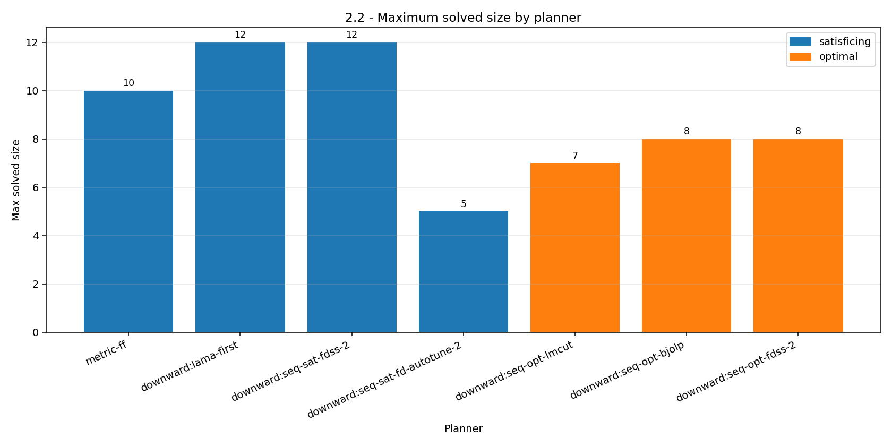
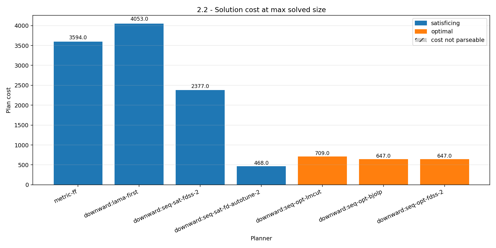
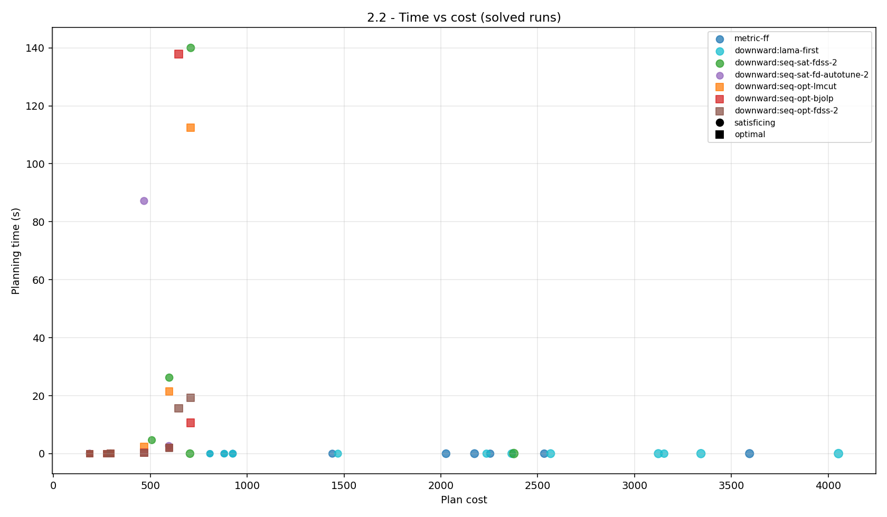

# Benchmark cost planners - Practice 1 Part 2 Exercise 2.2

- Generated at: `2026-03-16T14:29:38`
- Args: `{'min_size': 2, 'max_size': 12, 'step': 1, 'sizes': None, 'timeout': 180, 'domain': 'dronedomain2.pddl', 'generator': 'generate-problem.py', 'results_dir': 'results', 'drones': 1, 'carriers': 1, 'carrier_capacity': 4, 'exercise': 2, 'seed': None, 'problem_files': None}`

## [GENERATION]

| size | problem_file | status | wall_time_s | error_excerpt |
| --- | --- | --- | --- | --- |
| 2 | problems/drone_problem_ex2_d1_r1_l2_p2_c2_g2_a4.pddl | ok | 0.0454 |  |
| 3 | problems/drone_problem_ex2_d1_r1_l3_p3_c3_g3_a4.pddl | ok | 0.0424 |  |
| 4 | problems/drone_problem_ex2_d1_r1_l4_p4_c4_g4_a4.pddl | ok | 0.0414 |  |
| 5 | problems/drone_problem_ex2_d1_r1_l5_p5_c5_g5_a4.pddl | ok | 0.0404 |  |
| 6 | problems/drone_problem_ex2_d1_r1_l6_p6_c6_g6_a4.pddl | ok | 0.0425 |  |
| 7 | problems/drone_problem_ex2_d1_r1_l7_p7_c7_g7_a4.pddl | ok | 0.0462 |  |
| 8 | problems/drone_problem_ex2_d1_r1_l8_p8_c8_g8_a4.pddl | ok | 0.0395 |  |
| 9 | problems/drone_problem_ex2_d1_r1_l9_p9_c9_g9_a4.pddl | ok | 0.0401 |  |
| 10 | problems/drone_problem_ex2_d1_r1_l10_p10_c10_g10_a4.pddl | ok | 0.0434 |  |
| 11 | problems/drone_problem_ex2_d1_r1_l11_p11_c11_g11_a4.pddl | ok | 0.0417 |  |
| 12 | problems/drone_problem_ex2_d1_r1_l12_p12_c12_g12_a4.pddl | ok | 0.0394 |  |

## [RAW_ROWS]

| planner | family | status | size | planner_time_s | wall_time_s | plan_cost | plan_length | error_excerpt | problem_file |
| --- | --- | --- | --- | --- | --- | --- | --- | --- | --- |
| metric-ff | sat | solved | 2 | 0.0000 | 0.7727 | 808.0000 | 7 |  | problems/drone_problem_ex2_d1_r1_l2_p2_c2_g2_a4.pddl |
| metric-ff | sat | solved | 3 | 0.0000 | 0.7619 | 881.0000 | 11 |  | problems/drone_problem_ex2_d1_r1_l3_p3_c3_g3_a4.pddl |
| metric-ff | sat | solved | 4 | 0.0000 | 0.8046 | 926.0000 | 15 |  | problems/drone_problem_ex2_d1_r1_l4_p4_c4_g4_a4.pddl |
| metric-ff | sat | solved | 5 | 0.0000 | 0.8212 | 1440.0000 | 19 |  | problems/drone_problem_ex2_d1_r1_l5_p5_c5_g5_a4.pddl |
| metric-ff | sat | solved | 6 | 0.0000 | 0.8226 | 2255.0000 | 26 |  | problems/drone_problem_ex2_d1_r1_l6_p6_c6_g6_a4.pddl |
| metric-ff | sat | solved | 7 | 0.0100 | 0.9079 | 2534.0000 | 28 |  | problems/drone_problem_ex2_d1_r1_l7_p7_c7_g7_a4.pddl |
| metric-ff | sat | solved | 8 | 0.0000 | 0.8342 | 2027.0000 | 31 |  | problems/drone_problem_ex2_d1_r1_l8_p8_c8_g8_a4.pddl |
| metric-ff | sat | solved | 9 | 0.0100 | 0.8734 | 2174.0000 | 35 |  | problems/drone_problem_ex2_d1_r1_l9_p9_c9_g9_a4.pddl |
| metric-ff | sat | solved | 10 | 0.0200 | 0.9060 | 3594.0000 | 41 |  | problems/drone_problem_ex2_d1_r1_l10_p10_c10_g10_a4.pddl |
| metric-ff | sat | error | 11 |  | 0.8537 |  |  | ff: parsing domain file \| domain 'UBERMEDICS-CARRIERS-COSTS' defined \| ... done. \| ff: parsing problem file \| problem... (E001) | problems/drone_problem_ex2_d1_r1_l11_p11_c11_g11_a4.pddl |
| metric-ff | sat | error | 12 |  | 0.8459 |  |  | ff: parsing domain file \| domain 'UBERMEDICS-CARRIERS-COSTS' defined \| ... done. \| ff: parsing problem file \| problem... (E002) | problems/drone_problem_ex2_d1_r1_l12_p12_c12_g12_a4.pddl |
| downward:lama-first | sat | solved | 2 | 0.0042 | 1.3125 | 808.0000 | 7 |  | problems/drone_problem_ex2_d1_r1_l2_p2_c2_g2_a4.pddl |
| downward:lama-first | sat | solved | 3 | 0.0046 | 1.1853 | 883.0000 | 13 |  | problems/drone_problem_ex2_d1_r1_l3_p3_c3_g3_a4.pddl |
| downward:lama-first | sat | solved | 4 | 0.0050 | 1.2173 | 926.0000 | 15 |  | problems/drone_problem_ex2_d1_r1_l4_p4_c4_g4_a4.pddl |
| downward:lama-first | sat | solved | 5 | 0.0060 | 1.2122 | 1469.0000 | 20 |  | problems/drone_problem_ex2_d1_r1_l5_p5_c5_g5_a4.pddl |
| downward:lama-first | sat | solved | 6 | 0.0070 | 1.2357 | 2236.0000 | 24 |  | problems/drone_problem_ex2_d1_r1_l6_p6_c6_g6_a4.pddl |
| downward:lama-first | sat | solved | 7 | 0.0110 | 1.2289 | 3153.0000 | 32 |  | problems/drone_problem_ex2_d1_r1_l7_p7_c7_g7_a4.pddl |
| downward:lama-first | sat | solved | 8 | 0.0085 | 1.2602 | 2366.0000 | 33 |  | problems/drone_problem_ex2_d1_r1_l8_p8_c8_g8_a4.pddl |
| downward:lama-first | sat | solved | 9 | 0.0086 | 1.2754 | 2567.0000 | 37 |  | problems/drone_problem_ex2_d1_r1_l9_p9_c9_g9_a4.pddl |
| downward:lama-first | sat | solved | 10 | 0.0147 | 1.2353 | 3123.0000 | 39 |  | problems/drone_problem_ex2_d1_r1_l10_p10_c10_g10_a4.pddl |
| downward:lama-first | sat | solved | 11 | 0.0163 | 1.2995 | 3343.0000 | 49 |  | problems/drone_problem_ex2_d1_r1_l11_p11_c11_g11_a4.pddl |
| downward:lama-first | sat | solved | 12 | 0.0240 | 1.3432 | 4053.0000 | 53 |  | problems/drone_problem_ex2_d1_r1_l12_p12_c12_g12_a4.pddl |
| downward:seq-sat-fdss-2 | sat | solved | 2 | 0.0029 | 1.1790 | 276.0000 | 7 |  | problems/drone_problem_ex2_d1_r1_l2_p2_c2_g2_a4.pddl |
| downward:seq-sat-fdss-2 | sat | solved | 3 | 0.0021 | 1.2423 | 187.0000 | 11 |  | problems/drone_problem_ex2_d1_r1_l3_p3_c3_g3_a4.pddl |
| downward:seq-sat-fdss-2 | sat | solved | 4 | 0.1251 | 1.4093 | 295.0000 | 15 |  | problems/drone_problem_ex2_d1_r1_l4_p4_c4_g4_a4.pddl |
| downward:seq-sat-fdss-2 | sat | solved | 5 | 4.6765 | 5.6906 | 508.0000 | 19 |  | problems/drone_problem_ex2_d1_r1_l5_p5_c5_g5_a4.pddl |
| downward:seq-sat-fdss-2 | sat | solved | 6 | 26.2354 | 26.2684 | 598.0000 | 23 |  | problems/drone_problem_ex2_d1_r1_l6_p6_c6_g6_a4.pddl |
| downward:seq-sat-fdss-2 | sat | solved | 7 | 139.9982 | 134.5250 | 709.0000 | 27 |  | problems/drone_problem_ex2_d1_r1_l7_p7_c7_g7_a4.pddl |
| downward:seq-sat-fdss-2 | sat | solved | 8 | 0.0149 | 179.2541 | 705.0000 | 31 |  | problems/drone_problem_ex2_d1_r1_l8_p8_c8_g8_a4.pddl |
| downward:seq-sat-fdss-2 | sat | timeout | 9 | 0.0632 | 180.0376 | 929.0000 | 35 |  | problems/drone_problem_ex2_d1_r1_l9_p9_c9_g9_a4.pddl |
| downward:seq-sat-fdss-2 | sat | timeout | 10 | 0.0776 | 180.1124 | 1442.0000 | 39 |  | problems/drone_problem_ex2_d1_r1_l10_p10_c10_g10_a4.pddl |
| downward:seq-sat-fdss-2 | sat | timeout | 11 | 0.0394 | 180.0982 | 1648.0000 | 43 |  | problems/drone_problem_ex2_d1_r1_l11_p11_c11_g11_a4.pddl |
| downward:seq-sat-fdss-2 | sat | solved | 12 | 0.0482 | 179.3562 | 2377.0000 | 47 |  | problems/drone_problem_ex2_d1_r1_l12_p12_c12_g12_a4.pddl |
| downward:seq-sat-fd-autotune-2 | sat | solved | 2 | 0.0159 | 1.3037 | 276.0000 | 7 |  | problems/drone_problem_ex2_d1_r1_l2_p2_c2_g2_a4.pddl |
| downward:seq-sat-fd-autotune-2 | sat | solved | 3 | 0.0924 | 1.2965 | 187.0000 | 11 |  | problems/drone_problem_ex2_d1_r1_l3_p3_c3_g3_a4.pddl |
| downward:seq-sat-fd-autotune-2 | sat | solved | 4 | 2.6903 | 3.7672 | 596.0000 | 16 |  | problems/drone_problem_ex2_d1_r1_l4_p4_c4_g4_a4.pddl |
| downward:seq-sat-fd-autotune-2 | sat | solved | 5 | 87.1863 | 83.9719 | 468.0000 | 23 |  | problems/drone_problem_ex2_d1_r1_l5_p5_c5_g5_a4.pddl |
| downward:seq-sat-fd-autotune-2 | sat | timeout | 6 | 46.5458 | 180.0049 | 1183.0000 | 27 |  | problems/drone_problem_ex2_d1_r1_l6_p6_c6_g6_a4.pddl |
| downward:seq-sat-fd-autotune-2 | sat | timeout | 7 | 122.6261 | 180.0029 | 1507.0000 | 35 |  | problems/drone_problem_ex2_d1_r1_l7_p7_c7_g7_a4.pddl |
| downward:seq-sat-fd-autotune-2 | sat | timeout | 8 | 5.0895 | 180.0615 | 1537.0000 | 34 |  | problems/drone_problem_ex2_d1_r1_l8_p8_c8_g8_a4.pddl |
| downward:seq-sat-fd-autotune-2 | sat | timeout | 9 | 69.9660 | 180.0487 | 1757.0000 | 39 |  | problems/drone_problem_ex2_d1_r1_l9_p9_c9_g9_a4.pddl |
| downward:seq-sat-fd-autotune-2 | sat | timeout | 10 | 4.8751 | 180.0821 | 3229.0000 | 49 |  | problems/drone_problem_ex2_d1_r1_l10_p10_c10_g10_a4.pddl |
| downward:seq-sat-fd-autotune-2 | sat | timeout | 11 | 29.0646 | 180.0087 | 2656.0000 | 55 |  | problems/drone_problem_ex2_d1_r1_l11_p11_c11_g11_a4.pddl |
| downward:seq-sat-fd-autotune-2 | sat | timeout | 12 | 14.8039 | 180.0394 | 2876.0000 | 58 |  | problems/drone_problem_ex2_d1_r1_l12_p12_c12_g12_a4.pddl |
| downward:seq-opt-lmcut | opt | solved | 2 | 0.0057 | 1.4146 | 276.0000 | 9 |  | problems/drone_problem_ex2_d1_r1_l2_p2_c2_g2_a4.pddl |
| downward:seq-opt-lmcut | opt | solved | 3 | 0.0030 | 1.3514 | 187.0000 | 13 |  | problems/drone_problem_ex2_d1_r1_l3_p3_c3_g3_a4.pddl |
| downward:seq-opt-lmcut | opt | solved | 4 | 0.0312 | 1.3614 | 295.0000 | 19 |  | problems/drone_problem_ex2_d1_r1_l4_p4_c4_g4_a4.pddl |
| downward:seq-opt-lmcut | opt | solved | 5 | 2.4274 | 3.5760 | 468.0000 | 23 |  | problems/drone_problem_ex2_d1_r1_l5_p5_c5_g5_a4.pddl |
| downward:seq-opt-lmcut | opt | solved | 6 | 21.4247 | 21.8079 | 598.0000 | 29 |  | problems/drone_problem_ex2_d1_r1_l6_p6_c6_g6_a4.pddl |
| downward:seq-opt-lmcut | opt | solved | 7 | 112.4335 | 109.0710 | 709.0000 | 33 |  | problems/drone_problem_ex2_d1_r1_l7_p7_c7_g7_a4.pddl |
| downward:seq-opt-lmcut | opt | timeout | 8 |  | 180.0049 |  |  |  | problems/drone_problem_ex2_d1_r1_l8_p8_c8_g8_a4.pddl |
| downward:seq-opt-lmcut | opt | timeout | 9 |  | 180.0075 |  |  |  | problems/drone_problem_ex2_d1_r1_l9_p9_c9_g9_a4.pddl |
| downward:seq-opt-lmcut | opt | timeout | 10 |  | 180.0047 |  |  |  | problems/drone_problem_ex2_d1_r1_l10_p10_c10_g10_a4.pddl |
| downward:seq-opt-lmcut | opt | timeout | 11 |  | 180.0083 |  |  |  | problems/drone_problem_ex2_d1_r1_l11_p11_c11_g11_a4.pddl |
| downward:seq-opt-lmcut | opt | timeout | 12 |  | 180.0072 |  |  |  | problems/drone_problem_ex2_d1_r1_l12_p12_c12_g12_a4.pddl |
| downward:seq-opt-bjolp | opt | solved | 2 | 0.0032 | 1.1432 | 276.0000 | 9 |  | problems/drone_problem_ex2_d1_r1_l2_p2_c2_g2_a4.pddl |
| downward:seq-opt-bjolp | opt | solved | 3 | 0.0048 | 1.1258 | 187.0000 | 13 |  | problems/drone_problem_ex2_d1_r1_l3_p3_c3_g3_a4.pddl |
| downward:seq-opt-bjolp | opt | solved | 4 | 0.0095 | 1.1478 | 295.0000 | 19 |  | problems/drone_problem_ex2_d1_r1_l4_p4_c4_g4_a4.pddl |
| downward:seq-opt-bjolp | opt | solved | 5 | 0.3654 | 1.5013 | 468.0000 | 23 |  | problems/drone_problem_ex2_d1_r1_l5_p5_c5_g5_a4.pddl |
| downward:seq-opt-bjolp | opt | solved | 6 | 2.0872 | 3.0541 | 598.0000 | 29 |  | problems/drone_problem_ex2_d1_r1_l6_p6_c6_g6_a4.pddl |
| downward:seq-opt-bjolp | opt | solved | 7 | 10.6239 | 11.1577 | 709.0000 | 33 |  | problems/drone_problem_ex2_d1_r1_l7_p7_c7_g7_a4.pddl |
| downward:seq-opt-bjolp | opt | solved | 8 | 137.8678 | 132.1236 | 647.0000 | 38 |  | problems/drone_problem_ex2_d1_r1_l8_p8_c8_g8_a4.pddl |
| downward:seq-opt-bjolp | opt | timeout | 9 |  | 180.0049 |  |  |  | problems/drone_problem_ex2_d1_r1_l9_p9_c9_g9_a4.pddl |
| downward:seq-opt-bjolp | opt | timeout | 10 |  | 180.0024 |  |  |  | problems/drone_problem_ex2_d1_r1_l10_p10_c10_g10_a4.pddl |
| downward:seq-opt-bjolp | opt | timeout | 11 |  | 180.0063 |  |  |  | problems/drone_problem_ex2_d1_r1_l11_p11_c11_g11_a4.pddl |
| downward:seq-opt-bjolp | opt | timeout | 12 |  | 180.0058 |  |  |  | problems/drone_problem_ex2_d1_r1_l12_p12_c12_g12_a4.pddl |
| downward:seq-opt-fdss-2 | opt | solved | 2 | 0.0050 | 1.0938 | 276.0000 | 9 |  | problems/drone_problem_ex2_d1_r1_l2_p2_c2_g2_a4.pddl |
| downward:seq-opt-fdss-2 | opt | solved | 3 | 0.0049 | 1.0942 | 187.0000 | 13 |  | problems/drone_problem_ex2_d1_r1_l3_p3_c3_g3_a4.pddl |
| downward:seq-opt-fdss-2 | opt | solved | 4 | 0.0324 | 1.1316 | 295.0000 | 19 |  | problems/drone_problem_ex2_d1_r1_l4_p4_c4_g4_a4.pddl |
| downward:seq-opt-fdss-2 | opt | solved | 5 | 0.2465 | 1.4305 | 468.0000 | 23 |  | problems/drone_problem_ex2_d1_r1_l5_p5_c5_g5_a4.pddl |
| downward:seq-opt-fdss-2 | opt | solved | 6 | 1.9882 | 3.0180 | 598.0000 | 29 |  | problems/drone_problem_ex2_d1_r1_l6_p6_c6_g6_a4.pddl |
| downward:seq-opt-fdss-2 | opt | solved | 7 | 19.2524 | 19.5232 | 709.0000 | 33 |  | problems/drone_problem_ex2_d1_r1_l7_p7_c7_g7_a4.pddl |
| downward:seq-opt-fdss-2 | opt | solved | 8 | 15.6135 | 50.9164 | 647.0000 | 38 |  | problems/drone_problem_ex2_d1_r1_l8_p8_c8_g8_a4.pddl |
| downward:seq-opt-fdss-2 | opt | error | 9 | 180.5000 | 172.6375 |  |  | INFO     planner time limit: 180s \| INFO     planner memory limit: None \| INFO     Running translator. \| INFO     tra... (E003) | problems/drone_problem_ex2_d1_r1_l9_p9_c9_g9_a4.pddl |
| downward:seq-opt-fdss-2 | opt | error | 10 | 180.6400 | 171.6448 |  |  | INFO     planner time limit: 180s \| INFO     planner memory limit: None \| INFO     Running translator. \| INFO     tra... (E003) | problems/drone_problem_ex2_d1_r1_l10_p10_c10_g10_a4.pddl |
| downward:seq-opt-fdss-2 | opt | error | 11 | 180.2800 | 171.5853 |  |  | INFO     planner time limit: 180s \| INFO     planner memory limit: None \| INFO     Running translator. \| INFO     tra... (E003) | problems/drone_problem_ex2_d1_r1_l11_p11_c11_g11_a4.pddl |
| downward:seq-opt-fdss-2 | opt | error | 12 | 181.0400 | 172.6782 |  |  | INFO     planner time limit: 180s \| INFO     planner memory limit: None \| INFO     Running translator. \| INFO     tra... (E003) | problems/drone_problem_ex2_d1_r1_l12_p12_c12_g12_a4.pddl |

## [TABLE_2.2_SAT_SUMMARY]

| planner | family | max_solved_size | plan_cost_at_max_size | plan_length_at_max_size | wall_time_s_at_max_size | count_solved | count_timeout | count_unsolved | count_unsupported | count_error |
| --- | --- | --- | --- | --- | --- | --- | --- | --- | --- | --- |
| metric-ff | sat | 10 | 3594.0000 | 41 | 0.9060 | 9 | 0 | 0 | 0 | 2 |
| downward:lama-first | sat | 12 | 4053.0000 | 53 | 1.3432 | 11 | 0 | 0 | 0 | 0 |
| downward:seq-sat-fdss-2 | sat | 12 | 2377.0000 | 47 | 179.3562 | 8 | 3 | 0 | 0 | 0 |
| downward:seq-sat-fd-autotune-2 | sat | 5 | 468.0000 | 23 | 83.9719 | 4 | 7 | 0 | 0 | 0 |

## [TABLE_2.2_OPT_SUMMARY]

| planner | family | max_solved_size | plan_cost_at_max_size | plan_length_at_max_size | wall_time_s_at_max_size | count_solved | count_timeout | count_unsolved | count_unsupported | count_error |
| --- | --- | --- | --- | --- | --- | --- | --- | --- | --- | --- |
| downward:seq-opt-lmcut | opt | 7 | 709.0000 | 33 | 109.0710 | 6 | 5 | 0 | 0 | 0 |
| downward:seq-opt-bjolp | opt | 8 | 647.0000 | 38 | 132.1236 | 7 | 4 | 0 | 0 | 0 |
| downward:seq-opt-fdss-2 | opt | 8 | 647.0000 | 38 | 50.9164 | 7 | 0 | 0 | 0 | 4 |

## [TABLE_2.2_GLOBAL_SUMMARY]

| planner | family | max_solved_size | plan_cost_at_max_size | plan_length_at_max_size | wall_time_s_at_max_size | count_solved | count_timeout | count_unsolved | count_unsupported | count_error |
| --- | --- | --- | --- | --- | --- | --- | --- | --- | --- | --- |
| metric-ff | sat | 10 | 3594.0000 | 41 | 0.9060 | 9 | 0 | 0 | 0 | 2 |
| downward:lama-first | sat | 12 | 4053.0000 | 53 | 1.3432 | 11 | 0 | 0 | 0 | 0 |
| downward:seq-sat-fdss-2 | sat | 12 | 2377.0000 | 47 | 179.3562 | 8 | 3 | 0 | 0 | 0 |
| downward:seq-sat-fd-autotune-2 | sat | 5 | 468.0000 | 23 | 83.9719 | 4 | 7 | 0 | 0 | 0 |
| downward:seq-opt-lmcut | opt | 7 | 709.0000 | 33 | 109.0710 | 6 | 5 | 0 | 0 | 0 |
| downward:seq-opt-bjolp | opt | 8 | 647.0000 | 38 | 132.1236 | 7 | 4 | 0 | 0 | 0 |
| downward:seq-opt-fdss-2 | opt | 8 | 647.0000 | 38 | 50.9164 | 7 | 0 | 0 | 0 | 4 |

## [PLOTS]







## [ERROR_DETAILS]

### E001
```text
ff: parsing domain file | domain 'UBERMEDICS-CARRIERS-COSTS' defined | ... done. | ff: parsing problem file | problem 'DRONE_PROBLEM_EX2_D1_R1_L11_P11_C11_G11_A4' defined | ... done.
```

### E002
```text
ff: parsing domain file | domain 'UBERMEDICS-CARRIERS-COSTS' defined | ... done. | ff: parsing problem file | problem 'DRONE_PROBLEM_EX2_D1_R1_L12_P12_C12_G12_A4' defined | ... done.
```

### E003
```text
INFO     planner time limit: 180s | INFO     planner memory limit: None | INFO     Running translator. | INFO     translator stdin: None | INFO     translator time limit: 179s | INFO     translator memory limit: None
```
